# LearnOpengl

<!-- TOC -->

- [LearnOpengl](#learnopengl)
  - [Chapter1 getting_started](#chapter1-getting_started)
    - [1.1.hello_window](#11hello_window)
    - [1.2.hello_window_clear](#12hello_window_clear)
    - [2.1.hello_triangle](#21hello_triangle)
    - [2.2.hello_triangle_indexed](#22hello_triangle_indexed)
    - [2.3.hello_triangle_exercise1](#23hello_triangle_exercise1)
    - [2.4.hello_triangle_exercise2](#24hello_triangle_exercise2)
    - [2.5.hello_triangle_exercise3](#25hello_triangle_exercise3)
    - [3.1.shaders_uniform](#31shaders_uniform)
    - [3.2.shaders_interpolation](#32shaders_interpolation)
    - [3.3.shaders_class](#33shaders_class)
    - [3.4.shaders_exercise1](#34shaders_exercise1)
    - [3.5.shaders_exercise2](#35shaders_exercise2)
    - [3.6.shaders_exercise3](#36shaders_exercise3)
    - [4.1.textures](#41textures)
    - [4.2.textures_combined](#42textures_combined)
    - [4.4.textures_exercise2](#44textures_exercise2)
    - [4.5.textures_exercise3](#45textures_exercise3)
    - [4.6.textures_exercise4](#46textures_exercise4)
    - [5.1.transformations](#51transformations)
    - [5.2.transformations_exercise2](#52transformations_exercise2)
    - [6.1.coordinate_systems](#61coordinate_systems)
    - [6.2.coordinate_systems_depth](#62coordinate_systems_depth)
    - [6.3.coordinate_systems_multiple](#63coordinate_systems_multiple)
    - [7.1.camera_circle](#71camera_circle)
    - [7.2.camera_keyboard_dt](#72camera_keyboard_dt)
    - [7.3.camera_mouse_zoom](#73camera_mouse_zoom)
    - [7.4.camera_class](#74camera_class)
  - [Chapter2 lighting](#chapter2-lighting)
    - [1.colors](#1colors)
    - [2.1.basic_lighting_diffuse](#21basic_lighting_diffuse)
    - [2.2.basic_lighting_specular](#22basic_lighting_specular)
    - [3.1.materials](#31materials)
    - [3.2.materials_exercise1](#32materials_exercise1)
    - [4.1.lighting_maps_diffuse_map](#41lighting_maps_diffuse_map)
    - [4.2.lighting_maps_specular_map](#42lighting_maps_specular_map)
    - [4.4.lighting_maps_exercise4](#44lighting_maps_exercise4)
    - [5.1.light_casters_directional](#51light_casters_directional)
    - [5.2.light_casters_point](#52light_casters_point)
    - [5.3.light_casters_spot](#53light_casters_spot)
    - [5.4.light_casters_spot_soft](#54light_casters_spot_soft)
    - [6.multiple_lights](#6multiple_lights)
  - [Chapter3.model_loading](#chapter3model_loading)
    - [1.model_loading](#1model_loading)
  - [Chapter4.advanced_opengl](#chapter4advanced_opengl)
    - [1.1.depth_testing](#11depth_testing)
    - [1.2.depth_testing_view](#12depth_testing_view)
    - [2.stencil_testing](#2stencil_testing)
    - [3.1.blending_discard](#31blending_discard)
    - [3.2.blending_sort](#32blending_sort)
    - [5.1.framebuffers](#51framebuffers)
    - [5.2.framebuffers_exercise1](#52framebuffers_exercise1)
    - [6.1.cubemaps_skybox](#61cubemaps_skybox)
    - [6.2.cubemaps_environment_mapping](#62cubemaps_environment_mapping)
    - [8.advanced_glsl_ubo](#8advanced_glsl_ubo)
    - [9.1.geometry_shader_houses](#91geometry_shader_houses)
    - [9.2.geometry_shader_exploding](#92geometry_shader_exploding)
    - [9.3.geometry_shader_normals](#93geometry_shader_normals)
    - [10.1.instancing_quads](#101instancing_quads)
    - [10.2.asteroids](#102asteroids)
    - [10.3.asteroids_instanced](#103asteroids_instanced)
    - [11.1.anti_aliasing_msaa](#111anti_aliasing_msaa)
    - [11.2.anti_aliasing_offscreen](#112anti_aliasing_offscreen)
  - [Chapter5.advanced_lighting](#chapter5advanced_lighting)
    - [1.advanced_lighting](#1advanced_lighting)
    - [2.gamma_correction](#2gamma_correction)
    - [3.1.1.shadow_mapping_depth](#311shadow_mapping_depth)
    - [3.1.2.shadow_mapping_base](#312shadow_mapping_base)
    - [3.1.3.shadow_mapping](#313shadow_mapping)
    - [3.2.1.point_shadows](#321point_shadows)
    - [3.2.2.point_shadows_soft](#322point_shadows_soft)
    - [4.normal_mapping](#4normal_mapping)
    - [5.1.parallax_mapping](#51parallax_mapping)
    - [5.2.steep_parallax_mapping](#52steep_parallax_mapping)
    - [5.3.parallax_occlusion_mapping](#53parallax_occlusion_mapping)
    - [6.hdr](#6hdr)
    - [7.bloom](#7bloom)
    - [8.1.deferred_shading](#81deferred_shading)
    - [8.2.deferred_shading_volumes](#82deferred_shading_volumes)
    - [9.ssao](#9ssao)
  - [Chapter6.pbr](#chapter6pbr)
    - [1.1.lighting](#11lighting)
    - [1.2.lighting_textured](#12lighting_textured)
    - [2.1.1.ibl_irradiance_conversion](#211ibl_irradiance_conversion)
    - [2.1.2.ibl_irradiance](#212ibl_irradiance)
    - [2.2.1.ibl_specular](#221ibl_specular)
    - [2.2.2.ibl_specular_textured](#222ibl_specular_textured)
  - [Chapter7.in_practice](#chapter7in_practice)
    - [1.debugging](#1debugging)
    - [2.text_rendering](#2text_rendering)

<!-- /TOC -->

## Chapter1 getting_started

### 1.1.hello_window

### 1.2.hello_window_clear

### 2.1.hello_triangle

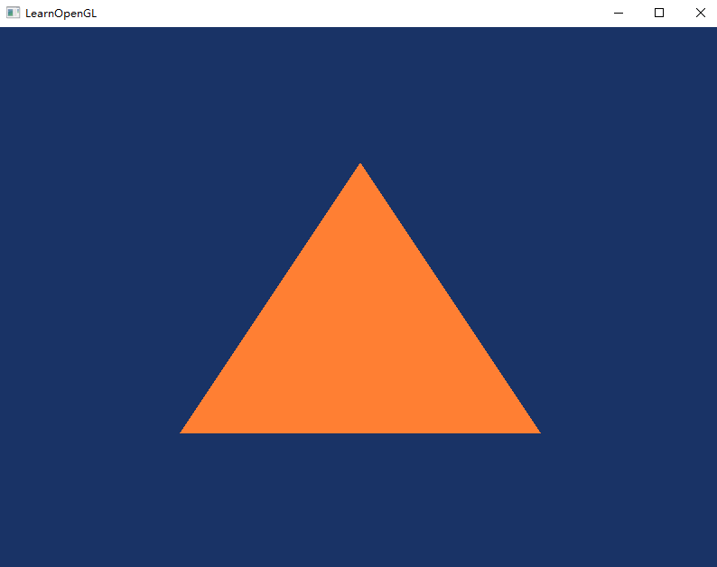

### 2.2.hello_triangle_indexed

### 2.3.hello_triangle_exercise1

### 2.4.hello_triangle_exercise2

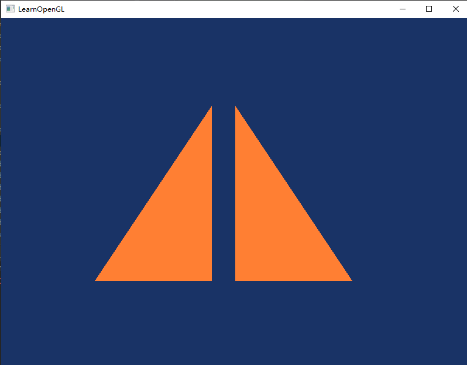

### 2.5.hello_triangle_exercise3

### 3.1.shaders_uniform

### 3.2.shaders_interpolation

### 3.3.shaders_class

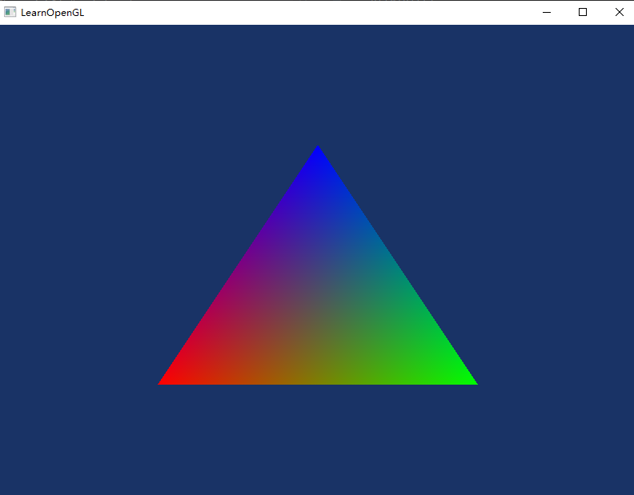

### 3.4.shaders_exercise1

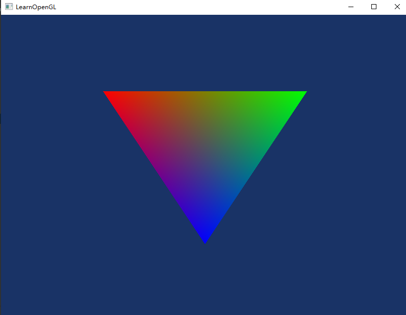

### 3.5.shaders_exercise2

### 3.6.shaders_exercise3

左下角是(-0.5,-0.5,0) clamp to (0.0,0.0,0.0) 所以黑色
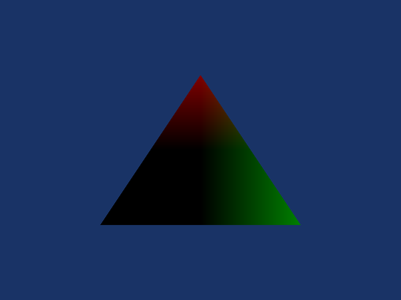

### 4.1.textures

### 4.2.textures_combined

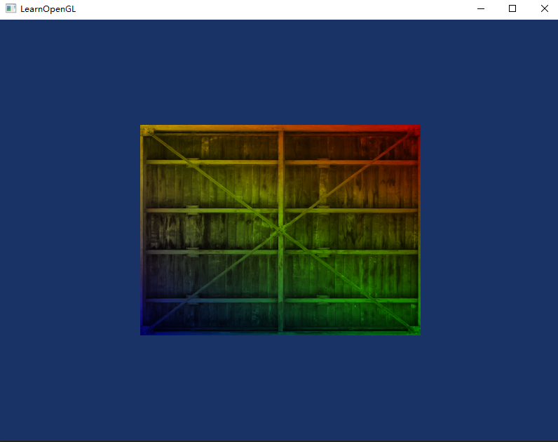

### 4.3.textures_exercise1

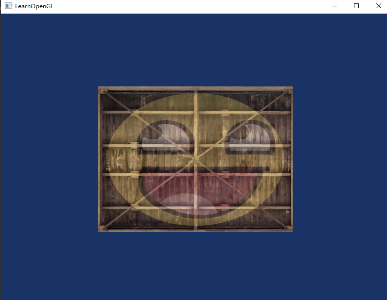

### 4.4.textures_exercise2

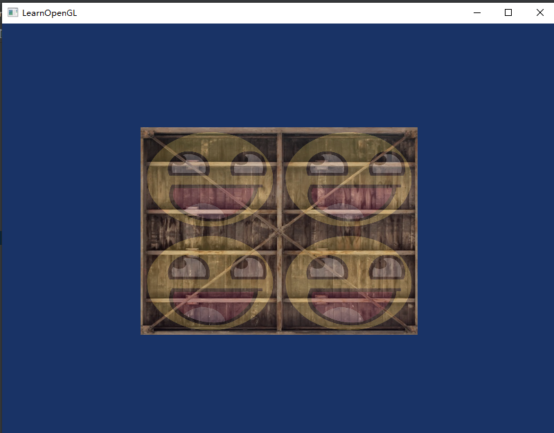

### 4.5.textures_exercise3

### 4.6.textures_exercise4

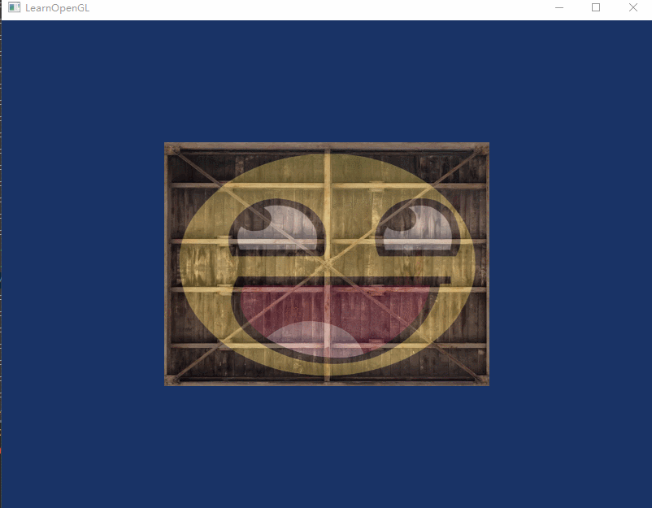

### 5.1.transformations

### 6.1.coordinate_systems

//省略了

### 6.2.coordinate_systems_depth

//省略了

### 6.3.coordinate_systems_multiple

用了EBO绘制 左右面 上下面的 UV是相邻的 所以看起来是被拉伸了。
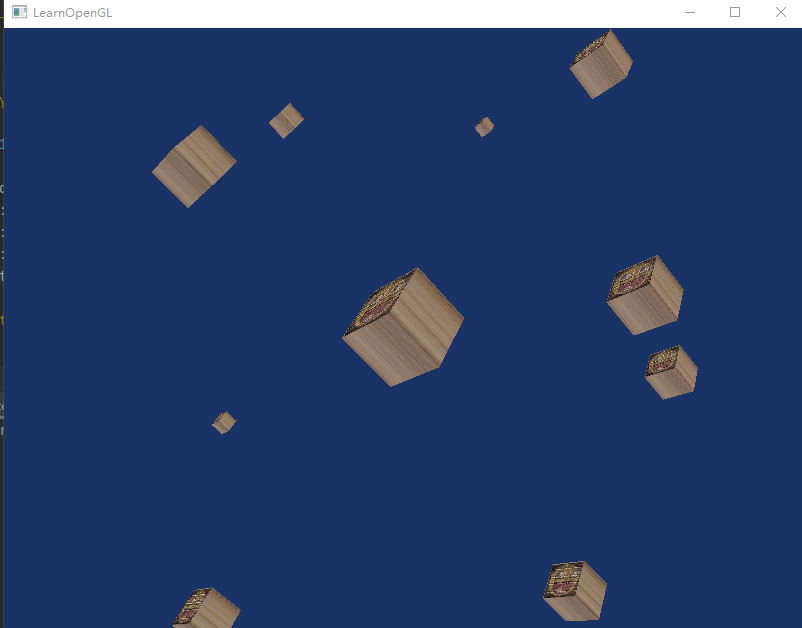

### 7.1.camera_circle

//see 7.4.camera_class

### 7.2.camera_keyboard_dt

//see 7.4.camera_class

### 7.3.camera_mouse_zoom

//see 7.4.camera_class

### 7.4.camera_class

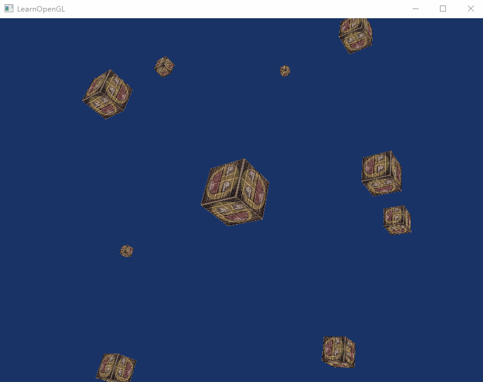

## Chapter2 lighting

### 1.colors

### 2.1.basic_lighting_diffuse

### 2.2.basic_lighting_specular

### 3.1.materials

### 3.2.materials_exercise1

### 4.1.lighting_maps_diffuse_map

### 4.2.lighting_maps_specular_map

### 4.4.lighting_maps_exercise4

### 5.1.light_casters_directional

### 5.2.light_casters_point

### 5.3.light_casters_spot

### 5.4.light_casters_spot_soft

### 6.multiple_lights

## Chapter3.model_loading

### 1.model_loading

## Chapter4.advanced_opengl

### 1.1.depth_testing

### 1.2.depth_testing_view

### 2.stencil_testing

### 3.1.blending_discard

### 3.2.blending_sort

### 5.1.framebuffers

### 5.2.framebuffers_exercise1

### 6.1.cubemaps_skybox

### 6.2.cubemaps_environment_mapping

### 8.advanced_glsl_ubo

### 9.1.geometry_shader_houses

### 9.2.geometry_shader_exploding

### 9.3.geometry_shader_normals

### 10.1.instancing_quads

### 10.2.asteroids

### 10.3.asteroids_instanced

### 11.1.anti_aliasing_msaa

### 11.2.anti_aliasing_offscreen

## Chapter5.advanced_lighting
### 1.advanced_lighting

### 2.gamma_correction

### 3.1.1.shadow_mapping_depth

### 3.1.2.shadow_mapping_base

### 3.1.3.shadow_mapping

### 3.2.1.point_shadows

### 3.2.2.point_shadows_soft

### 4.normal_mapping

### 5.1.parallax_mapping

### 5.2.steep_parallax_mapping

### 5.3.parallax_occlusion_mapping

### 6.hdr

### 7.bloom

### 8.1.deferred_shading

### 8.2.deferred_shading_volumes

### 9.ssao

## Chapter6.pbr
### 1.1.lighting

### 1.2.lighting_textured

### 2.1.1.ibl_irradiance_conversion

### 2.1.2.ibl_irradiance

### 2.2.1.ibl_specular

### 2.2.2.ibl_specular_textured

## Chapter7.in_practice
### 1.debugging

### 2.text_rendering

