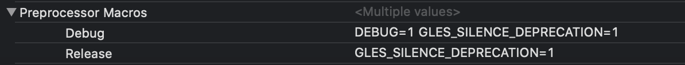
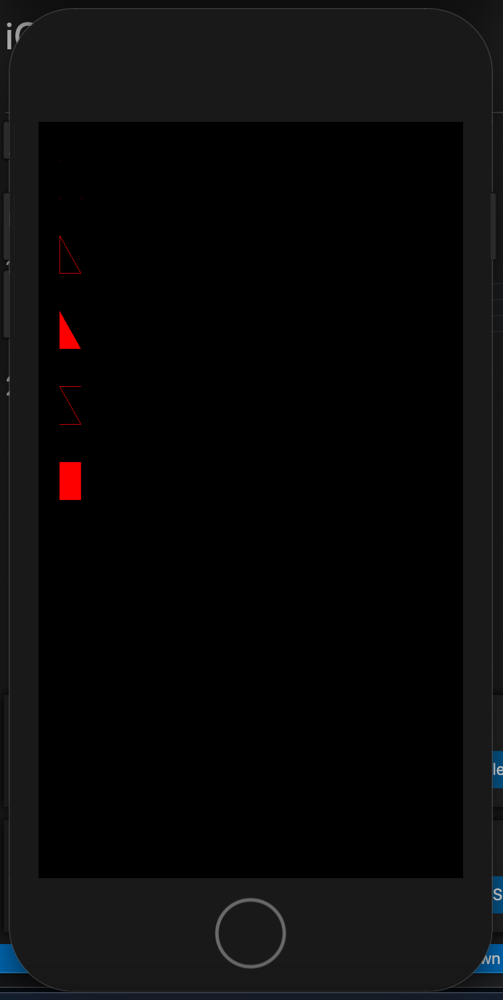

# iOS OpenGL ES 2.0学习

<!-- TOC -->

- [iOS OpenGL ES 2.0学习](#ios-opengl-es-20学习)
  - [OS OpenGL ES 2.0 开发（一）：绘制一个三角形](#os-opengl-es-20-开发一绘制一个三角形)
    - [1、xcode工程遇到的问题](#1xcode工程遇到的问题)
    - [2、结果如下：](#2结果如下)
  - [OS OpenGL ES 2.0 开发（二）：着色器（预告）](#os-opengl-es-20-开发二着色器预告)

<!-- /TOC -->
## OS OpenGL ES 2.0 开发（一）：绘制一个三角形
### 1、xcode工程遇到的问题
1、Storyboard的View的class要设置成GLKview

2、有Warning 要设置一个宏到build setting


### 2、结果如下：

```cpp
- (void)viewDidLoad {
    [super viewDidLoad];

    //1、上下文准备
   GLKView *view = (GLKView *)self.view;
   view.context = [[EAGLContext alloc] initWithAPI:kEAGLRenderingAPIOpenGLES2];
   [EAGLContext setCurrentContext:view.context];

   self.baseEffect = [[GLKBaseEffect alloc] init];
   self.baseEffect.useConstantColor = GL_TRUE;
   self.baseEffect.constantColor = GLKVector4Make(1.0f,0.0f,0.0f,1.0f);
   
    //清除颜色 用白色来清除一遍缓冲区
   glClearColor(0.0f, 0.0f, 0.0f, 1.0f);
    
   //2、生成一个缓冲ID三个步骤：生成id 绑定id 传入数据
   glGenBuffers(1, &_vertexBufferID);
   glBindBuffer(GL_ARRAY_BUFFER, _vertexBufferID);
   glBufferData(GL_ARRAY_BUFFER, sizeof(verticesForTriangle), verticesForTriangle, GL_STATIC_DRAW);
}

 

- (void)glkView:(GLKView *)view drawInRect:(CGRect)rect{
    [self.baseEffect prepareToDraw];
    glClear(GL_COLOR_BUFFER_BIT);

    //3.1 启动顶点缓存渲染操作
    glEnableVertexAttribArray(GLKVertexAttribPosition);

   //3.2 设置顶点缓冲的属性
    glVertexAttribPointer(GLKVertexAttribPosition, 3
                         , GL_FLOAT, GL_FALSE, sizeof(SceneVertex), NULL);
    //3.3 绘制
    glDrawArrays(GL_POINTS, 0, 3);
    glDrawArrays(GL_LINE_LOOP, 3, 3);
    glDrawArrays(GL_TRIANGLES, 6, 3);
    glDrawArrays(GL_LINE_STRIP, 9, 4);
    glDrawArrays(GL_TRIANGLE_STRIP, 13, 4);
}

-(void)dealloc{
    //4. 清理
    GLKView *view = (GLKView *)self.view;
    [EAGLContext setCurrentContext:view.context];
    
    if (0!=_vertexBufferID) {
        glDeleteBuffers(1, &_vertexBufferID);
        _vertexBufferID = 0;
    }
    
    ((GLKView *)self.view).context = nil;
    [EAGLContext setCurrentContext:nil];
}
```



## OS OpenGL ES 2.0 开发（二）：着色器（预告）